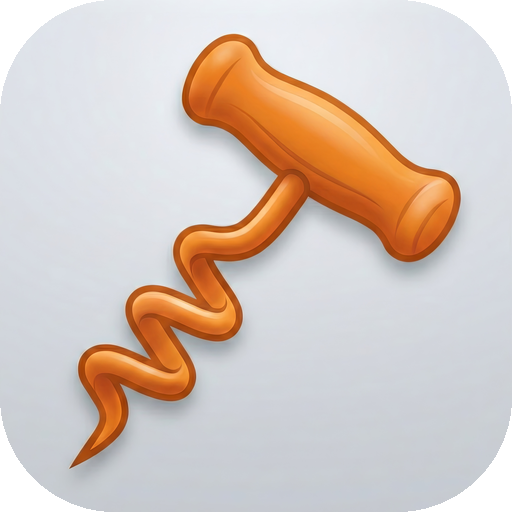

<p align="center">
  
</p>

<h1 align="center">Corkscrew</h1>

<p align="center">
  <strong>A native mod manager for Wine games on macOS and Linux.</strong>
</p>

<p align="center">
  <a href="#features">Features</a>&nbsp;&nbsp;&bull;&nbsp;&nbsp;
  <a href="#installation">Installation</a>&nbsp;&nbsp;&bull;&nbsp;&nbsp;
  <a href="#supported-platforms">Platforms</a>&nbsp;&nbsp;&bull;&nbsp;&nbsp;
  <a href="#how-it-works">How It Works</a>&nbsp;&nbsp;&bull;&nbsp;&nbsp;
  <a href="#contributing">Contributing</a>
</p>

<br>

Corkscrew installs, manages, and organizes mods for Windows games running through [CrossOver](https://www.codeweavers.com/crossover), [Whisky](https://getwhisky.app/), [Lutris](https://lutris.net/), [Proton](https://github.com/ValveSoftware/Proton), and other Wine-based compatibility layers — no Windows VM required.

It works by reading and writing directly to your Wine bottle's filesystem, the same way the game itself sees it. Your bottles, your mods, no middleman.

> **Status:** Early development. Skyrim Special Edition is the first supported game. Expect rough edges — and contributions.

---

## Features

- **Automatic bottle detection** — Finds CrossOver, Whisky, Moonshine, Heroic, Mythic, Lutris, Proton, and native Wine prefixes
- **Game scanning** — Discovers supported titles across all bottles (Skyrim SE via Steam or GOG to start)
- **Mod installation** — Handles `.zip`, `.7z`, and `.rar` archives, deploys to the correct `Data/` directory with smart root detection
- **Nexus Mods integration** — Download and install directly from NXM links
- **Mod tracking** — SQLite database records every installed file for clean uninstalls
- **Plugin load order** — Reads and syncs `plugins.txt` and `loadorder.txt` for Bethesda games
- **FOMOD support** — Parses the standard XML-based mod installer format
- **Cross-platform** — Native app for both macOS and Linux (SteamOS, Fedora, Ubuntu)

### Planned

- FOMOD wizard UI with option selection
- Drag-and-drop mod archive installation
- Mod profiles
- Nexus Mods modlist support
- Wabbajack modlist support
- Mod conflict detection and resolution

---

## Installation

### Requirements

- macOS 10.15+ or Linux with GTK 3 / WebKitGTK
- A Wine-based runner (CrossOver, Whisky, Lutris, Proton, etc.)

### From Release

Download the latest release for your platform:

| Platform | Format |
|----------|--------|
| macOS | `.dmg` (drag to Applications) |
| Linux | AppImage, `.deb`, `.rpm` |

### From Source

```bash
git clone https://github.com/cashcon57/corkscrew.git
cd corkscrew
npm install
cargo tauri build
```

Requires [Node.js](https://nodejs.org/) and a [Rust toolchain](https://rustup.rs/).

---

## Supported Platforms

### Bottle Sources

| Source | macOS | Linux |
|--------|:-----:|:-----:|
| CrossOver | &check; | &check; |
| Whisky | &check; | — |
| Moonshine | &check; | — |
| Heroic (Wine) | &check; | &check; |
| Mythic | &check; | — |
| Lutris | — | &check; |
| Proton / Steam | — | &check; |
| Bottles | — | &check; |
| Native Wine | &check; | &check; |

### Games

| Game | ID | Status |
|------|----|--------|
| Skyrim Special Edition | `skyrimse` | Working |
| *More to come* | | Planned |

Adding a new game is a matter of writing a small plugin — see [`plugins/skyrim_se.rs`](src-tauri/src/plugins/skyrim_se.rs) for the pattern.

---

## How It Works

Wine bottles are just directories. A CrossOver bottle at `~/Library/Application Support/CrossOver/Bottles/MyBottle/` has a `drive_c/` folder that maps to the game's `C:\` drive.

Corkscrew navigates this structure natively to find game installs and deploy mod files — no Wine runtime needed, no Windows tools required. For Skyrim SE, mods go into the `Data/` directory within the game install. Corkscrew figures out the right path, extracts your archive, and puts files where the game expects them.

### Architecture

Built with [Tauri v2](https://v2.tauri.app/) for a small, fast, native experience:

- **Frontend** — [Svelte 5](https://svelte.dev/) + [SvelteKit](https://svelte.dev/docs/kit) with static adapter
- **Backend** — Rust with async I/O, SQLite, and direct filesystem access
- **Bundle** — Single binary, ~9 MB on macOS

```
src/                    Svelte frontend
src-tauri/src/
├── bottles.rs          Bottle detection (macOS + Linux paths)
├── games.rs            Game detection framework + plugin registry
├── installer.rs        Archive extraction and mod deployment
├── database.rs         SQLite mod tracking
├── nexus.rs            Nexus Mods API client
├── config.rs           Configuration management
├── fomod.rs            FOMOD installer XML parser
└── plugins/
    ├── skyrim_se.rs    Skyrim SE game plugin
    └── skyrim_plugins.rs  Plugin load order management
```

---

## Contributing

This is a young project and there's plenty to do. If you're a Mac or Linux gamer who's tired of manually dragging files into Wine prefixes, you're the target audience — and probably the ideal contributor.

Bug reports, feature requests, and pull requests are all welcome.

## Acknowledgments

- [CrossOver](https://www.codeweavers.com/crossover) by CodeWeavers
- [Nexus Mods](https://www.nexusmods.com/) for the modding community and API
- [Mod Organizer 2](https://github.com/ModOrganizer2/modorganizer) and [Vortex](https://github.com/Nexus-Mods/Vortex) for blazing the trail
- The [FOMOD](https://fomod-docs.readthedocs.io/) standard
- [Wine](https://www.winehq.org/) and all the compatibility layer projects

## License

GPL-3.0-or-later. See [LICENSE](LICENSE) for details.
